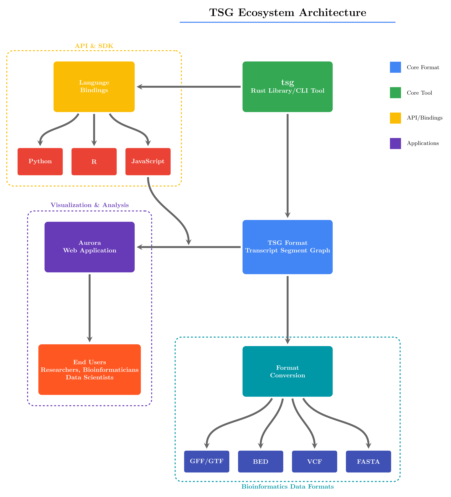

# TSG Ecosystem

Welcome to the TSG (Transcript Segment Graph) ecosystem documentation. TSG is a new format designed for efficient representation and analysis of transcript data in graph format.

## What is TSG?

TSG (Transcript Segment Graph) is a specialized format that combines the benefits of transcript segment data structures with graph-based representations. This format enables powerful analysis, visualization, and processing of transcript data with complex relationships.

## Core Components of the TSG Ecosystem

The TSG ecosystem consists of several integrated tools designed to work with the TSG format:

### 1. TSG Core Library

Our foundational library that provides the basic data structures and algorithms for working with TSG data. It includes:

- Data conversion utilities
- Core graph operations
- Transcript segment processing functions
- Serialization/deserialization capabilities

### 2. TSG Visualizer

An interactive visualization tool that renders TSG data in intuitive and informative ways:

- Transcript views
- Network graph visualizations
- Customizable rendering options
- Real-time data exploration

### 3. TSG Analytics Suite

Advanced analytical tools built specifically for TSG data:

- Pattern recognition algorithms
- Anomaly detection
- Predictive modeling
- Statistical analysis functions

### 4. TSG Converter

Utilities for converting between TSG and other common formats:

- CSV/TSV import/export
- Integration with popular transcript databases
- Support for standard graph formats

## Getting Started

To begin working with the TSG ecosystem, check out our [Quick Start Guide](./quickstart.md) or explore the individual tool documentation linked below.

## Community and Support

Join our growing community of TSG users and contributors:

- [GitHub Repository](https://github.com/TSGECO)
- [Community Forum](https://community.tsg-ecosystem.org)
- [Issue Tracker](https://github.com/TSGECO/issues)
